  <picture>
    <source media="(prefers-color-scheme: dark)" srcset="./dark.svg">
    <source media="(prefers-color-scheme: light)" srcset="./light.svg">
    
  </picture>

  

  
  
  
  

  
  &nbsp;&nbsp;
  
  &nbsp;&nbsp;
  
  &nbsp;&nbsp;
  

Fullstack software engineer. I take products from UI to API to payment to deploy. AI features in my apps read live databases, so they do not invent prices, stock, or jobs.

**Teknik Informatika, Universitas Malikussaleh (GPA 3.66)** · **Hacktiv8 AI-Enhanced Full Stack Developer** · Indonesia, remote or relocate, available immediately.

## Deployed products

These are live systems, not tutorial clones.

**[RAC - Recommendation Auto Car](https://rac.kabanroom.web.id/)** `LIVE`
LangChain RAG car advisor grounded on a live MongoDB catalog, then 360 inspection, credit simulation, and nearby dealers.
`LangChain · Groq · Node.js · MongoDB · React · Midtrans`
[Live](https://rac.kabanroom.web.id/) · [GitHub](https://github.com/malthafkiram/Recommendation-Auto-Car)

**[LamarKerja AI](https://lamarkerja.kabanroom.web.id)** `LIVE`
Job application suite across 12 portals: OCR flyer scanner, AI cover letters, ATS CV audit, and mock interviews.
`Express · PostgreSQL · Groq · Tesseract · React`
[Live](https://lamarkerja.kabanroom.web.id) · [GitHub](https://github.com/malthafkiram/LamarKerja-AI)

**[Dialektika](https://dialektikaa.vercel.app/)** `LIVE`
Next.js bookstore with HttpOnly JWT auth, catalog search, wishlist, cart, and checkout.
`Next.js · TypeScript · MongoDB · Zod · Vercel`
[Live](https://dialektikaa.vercel.app/) · [GitHub](https://github.com/malthafkiram/Dialektika)

**[WhaleWatch AI](https://clien-five.vercel.app/)** `LIVE`
Crypto dashboard with live market radar, whale alerts, Groq copilot, paper trading, and Midtrans VIP.
`React · Express · PostgreSQL · Groq · Swagger`
[Live](https://clien-five.vercel.app/) · [GitHub](https://github.com/malthafkiram/WhaleWatch-AI-Public)

**[Bug Brawl](https://bugbrawl.sparda.id)** `LIVE`
1v1 debugging arena. Socket.IO rooms, automated tests, DeepSeek scoring, live leaderboard.
`Socket.IO · Express · PostgreSQL · DeepSeek`
[Live](https://bugbrawl.sparda.id) · [API docs](https://bbapi.sparda.id/api-docs) · [GitHub](https://github.com/Debugging-E-Sport/Debugging-E-Sport)

## Stack

  

**Frontend:** React, Next.js, TypeScript, Tailwind CSS, React Native / Expo
**Backend:** Node.js, Express, GraphQL / Apollo, REST, Socket.IO, JWT
**Data:** PostgreSQL, MongoDB, Redis, Sequelize
**AI:** LangChain RAG, Groq LLaMA, Tesseract OCR, DeepSeek
**Cloud:** AWS EC2, Vercel, Midtrans Snap

## Activity

  
   
  
  

  <picture>
    <source media="(prefers-color-scheme: dark)" srcset="https://raw.githubusercontent.com/malthafkiram/malthafkiram/output/github-snake-dark.svg" />
    <source media="(prefers-color-scheme: light)" srcset="https://raw.githubusercontent.com/malthafkiram/malthafkiram/output/github-snake.svg" />
    
  </picture>

  <a href="mailto:malthafkiram@gmail.com"><strong>Hire me</strong></a>
  ·
  <a href="https://www.linkedin.com/in/malthafkiram">LinkedIn</a>
  ·
  <a href="https://porto.kabanroom.web.id/">Portfolio</a>
  ·
  <a href="https://wa.me/6285157715522">WhatsApp</a>

